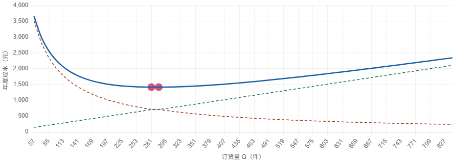
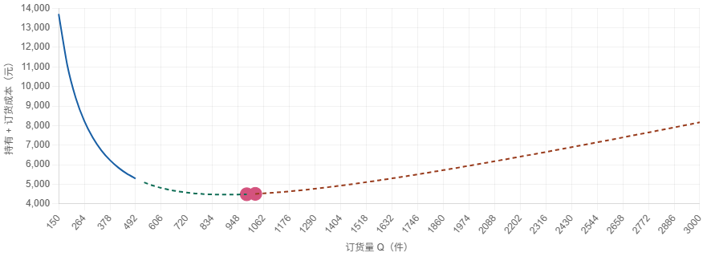
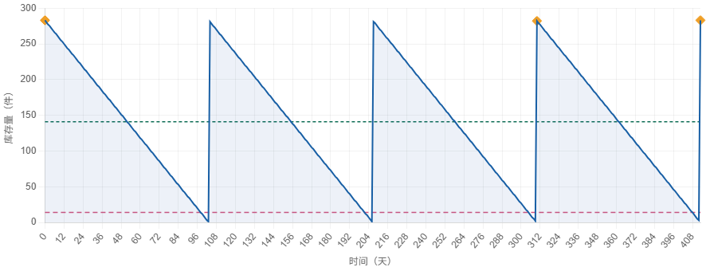
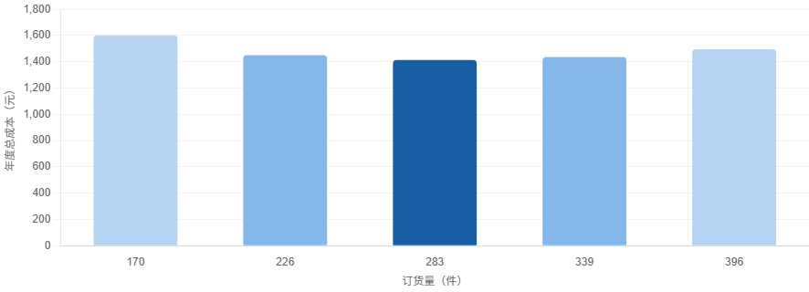

# EOQ 经济订货量模型 — 交互式教学工具

> 单文件 HTML + Chart.js，零构建、零安装，打开即用。
> 专为物流学课堂演示与学生自学设计。

---

## 功能概览

本工具将经典库存管理模型 **EOQ（Economic Order Quantity）** 拆解为四个可交互的标签页，学生可以实时拖动参数滑块，观察公式、图表与指标卡片同步变化，把“纸上推导”变成“看得见的关系”。

| 标签页 | 核心内容 | 教学目的 |
|--------|----------|----------|
| **经典 EOQ** | 成本 U 型曲线、持有/订货成本权衡 | 理解 EOQ 公式来源与最优解 |
| **价格折扣 EOQ** | 全量折扣多区间比较、可行解判定 | 掌握分段定价下的订货决策 |
| **库存动态** | 锯齿图、再订货点 ROP、平均库存 | 建立“时间维度”的库存直觉 |
| **敏感性分析** | 偏离 EOQ ±20% / ±40% 的成本增幅 | 体会平方根效应与决策鲁棒性 |

---

## 快速开始

### 方式一：直接打开（推荐）

1. 下载本仓库中的 `eoq-teaching-tool.html`。
2. 双击文件，用任意现代浏览器打开即可。

无需 Node、无需构建、无需服务器。

### 方式二：本地 HTTP 服务器

如果你需要在本机通过 `http://localhost` 访问：

```bash
# 使用 Python 内置服务器
python -m http.server 8080

# 然后访问
# http://localhost:8080/eoq-teaching-tool.html
```

---

## 在线预览

> 计划通过 GitHub Pages / AtomGit Pages 部署。部署后在此处填写地址。

---

## 页面截图

### 1. 经典 EOQ — 总成本 U 型曲线



拖动年需求量 `D`、订货成本 `S`、持有成本 `H`，蓝色总成本曲线会实时重绘，并在最低点标注 **EOQ 最优订货量**。

### 2. 价格折扣 EOQ — 多区间总成本比较



支持 2~5 个折扣区间，可切换两种持有成本模式：

- **持有成本率模式**：`H = r × P`（教材推荐）
- **固定持有成本模式**：`H = 常数`

系统会自动在每个区间计算 EOQ，判断可行性（是否落在该区间内），比较总成本后给出最优订货量和最优单价。

### 3. 库存动态 — 锯齿图与再订货点



参数与**经典 EOQ** 面板同步。可调整：

- 提前期 `L`
- 显示周期数

图中标注了 **库存水位**、**平均库存 Q/2**、**再订货点 ROP** 和 **补货时点**，直观展示订货-消耗循环。

### 4. 敏感性分析 — 平方根效应



对比订货量偏离 EOQ 时的成本增幅。中心教学点：

> EOQ 附近成本曲线“平坦”——参数估计存在一定误差，总成本也不会大幅上升。

---

## 参数说明

### 经典 EOQ 面板

| 参数 | 含义 | 默认值 | 范围 |
|------|------|--------|------|
| `D` | 年需求量（件/年） | 1000 | 100 ~ 10,000 |
| `S` | 每次订货成本（元/次） | 200 | 10 ~ 5,000 |
| `H` | 单位持有成本（元/件/年） | 5 | 1 ~ 100 |

### 价格折扣 EOQ 面板

| 参数 | 含义 | 默认值 | 范围 |
|------|------|--------|------|
| `D` | 年需求量（件/年） | 10,000 | 100 ~ 100,000 |
| `S` | 每次订货成本（元/次） | 100 | 10 ~ 5,000 |
| `r` | 持有成本率 | 0.20 | 0.05 ~ 0.50 |
| `H` | 固定持有成本 | 5 | 1 ~ 100 |
| 折扣区间 | 起订量 `Qmin` 与 单价 `P` | 见表格 | 2 ~ 5 个区间 |

### 库存动态面板

| 参数 | 含义 | 默认值 | 范围 |
|------|------|--------|------|
| `L` | 提前期（天） | 5 | 0 ~ 30 |
| 显示周期数 | 锯齿图展示周期 | 4 | 2 ~ 8 |

### 敏感性分析面板

- 偏离比例：`-40%`、`−20%`、`EOQ`、`+20%`、`+40%`
- 同步经典 EOQ 参数，实时更新。

---

## 核心公式

| 模型 | 公式 |
|------|------|
| 经典 EOQ | `EOQ = √(2DS / H)` |
| 年持有成本 | `Ch = (Q / 2) × H` |
| 年订货成本 | `Co = (D / Q) × S` |
| 年总成本 | `TC = Ch + Co` |
| 再订货点 | `ROP = (D / 365) × L` |
| 订货周期 | `T = 365 × EOQ / D` |
| 折扣模型总成本 | `TC = (Q/2) × Hi + (D/Q) × S + D × Pi` |

---

## 技术栈

- **单文件 HTML5**：无框架、无构建步骤。
- **Chart.js 4.4.1**：通过 CDN 引入，负责全部图表渲染。
- **原生 JavaScript (ES6)**：滑块联动、参数校验、计算与 DOM 更新。
- **响应式布局**：支持桌面端与移动端浏览。

---

## 浏览器兼容

- Chrome / Edge / Firefox / Safari 最新版
- 需要支持 ES6 的现代浏览器
- 无需互联网即可使用（Chart.js 通过 CDN 加载，若离线需替换成本地文件）

---

## 文件结构

```text
EOQ/
├── eoq-teaching-tool.html    # 主程序（单文件）
├── assets/                   # 截图资源
│   ├── classic-eoq.png
│   ├── discount-eoq.png
│   ├── inventory-sawtooth.png
│   └── sensitivity-analysis.png
├── test_calculations.js      # 计算逻辑验证脚本
├── .gitignore                # Git 忽略规则
└── README.md                 # 本文件
```

---

## 开发路线图

- [x] 阶段一：经典 EOQ + 全量价格折扣 EOQ
- [x] 阶段二：库存锯齿图 + 敏感性分析
- [ ] 阶段三：习题练习模式 + 增量折扣扩展
- [ ] 阶段四：导出/打印讲义、移动端手势优化

---

## 教学使用建议

1. **课堂演示**：使用投影仪打开页面，边拖动滑块边讲解公式含义。
2. **翻转课堂**：让学生课前调节参数，记录 EOQ 与成本变化规律。
3. **案例分析**：把企业实际数据代入折扣模型，讨论最优订货策略。

---

## 关于作者

- **作者**：大卡（高校物流学教师）
- **GitHub**：[@daka-agent](https://github.com/daka-agent)
- **用途**：物流学课堂教学与学生自学

---

## 许可证

本项目采用 [MIT License](LICENSE) 开源，欢迎 Fork 与二次教学使用。

---

## 致谢

- 图表库：[Chart.js](https://www.chartjs.org/)
- 字体栈：系统默认字体，无需额外下载

